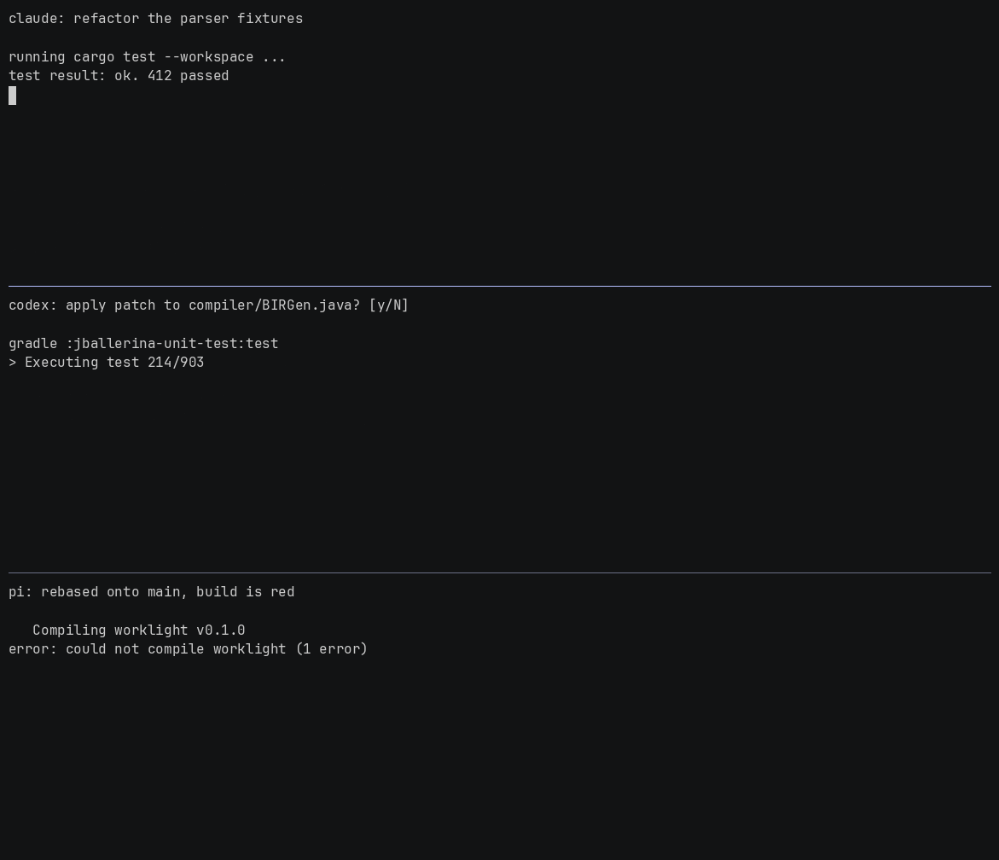

# Worklight

Worklight tracks long-running foreground commands and AI agent sessions. Its terminal panel shows
their status and can jump back to the originating tmux pane.



The panel lists agents (Claude, Codex, Pi — whatever has a hook installed) and the long-running
processes detected by the shell hook. It shows each item's state, elapsed time, and origin. `Enter`
jumps to the originating pane and closes the panel, `a` acknowledges completed work, `h` shows
history, and `q` closes the panel.

## Install

Worklight requires mise, Rust, and Python 3. Run these commands from the repository root.

Install only the CLI:

```sh
mise run install
command -v worklight
worklight --help
```

Install the CLI and all integrations:

```sh
mise run setup -- --dry-run
mise run setup -- -y
```

Setup installs all integrations together; it has no per-integration selector. Changed files are
backed up as `.worklight-<timestamp>.bak`.

| Component | Installed files | Activation |
| --- | --- | --- |
| CLI | `${CARGO_HOME:-$HOME/.cargo}/bin/worklight` | None |
| zsh | `integrations.zsh` and a loader block in `.zshrc` | Start a new zsh session. |
| tmux | `integrations.tmux` and a loader block in `tmux.conf` | Reload tmux; Prefix + Space opens Worklight. |
| Pi | `${PI_CODING_AGENT_DIR:-$HOME/.pi/agent}/extensions/worklight/index.ts` | New processes load it automatically; use `/reload` in an existing process. |
| Claude Code | `${CLAUDE_CONFIG_DIR:-$HOME/.claude}/worklight/hook.py` and entries in `settings.json` | Start a new session. |
| Codex | `integrations.codex.py` and entries in `${CODEX_HOME:-$HOME/.codex}/hooks.json` | Start a new session, then review and trust the hooks with `/hooks`. |

Reload the default tmux server during setup, or specify a socket:

```sh
mise run setup -- -y --reload-tmux
mise run setup -- -y --reload-tmux /path/to/socket
```

## Configuration

Worklight options:

| Option or variable | Description |
| --- | --- |
| `--database PATH` | Use a specific SQLite database. |
| `WORKLIGHT_DB` | Set the database when `--database` is omitted. |
| `XDG_DATA_HOME` | Set the default data directory; the fallback is `$HOME/.local/share`. |
| `--dry-run` | Read and validate without writing, navigating, or creating tracking rows. |

The default database is `${XDG_DATA_HOME:-$HOME/.local/share}/worklight/worklight.db`.

Setup options and path overrides:

| Option or variable | Description |
| --- | --- |
| `-y`, `--yes` | Apply changes without prompting. |
| `--dry-run` | Preview changes without building or writing. |
| `--zshrc PATH` | Select the zsh configuration to edit. |
| `--tmux-conf PATH` | Select the tmux configuration to edit. |
| `--reload-tmux [SOCKET]` | Load the generated integration into a running tmux server. |
| `CARGO_HOME` | Select Cargo's installation directory. |
| `XDG_CONFIG_HOME` | Select the config directory; the fallback is `$HOME/.config`. |
| `ZDOTDIR` | Select `.zshrc` when `--zshrc` is omitted. |
| `PI_CODING_AGENT_DIR` | Select the Pi agent directory. |
| `CLAUDE_CONFIG_DIR` | Select the Claude Code configuration directory. |
| `CODEX_HOME` | Select the Codex configuration directory. |
| `XDG_STATE_HOME` | Select the Claude hook state directory; the fallback is `$HOME/.local/state`. |

Use the same overrides for both the preview and apply commands.

## Demo

The recording above is scripted: `scripts/demo/record.sh` builds a throwaway tmux session against a
scratch database, drives it, and renders `docs/demo.gif`. It requires `asciinema` and `agg`.

## Develop

```sh
mise run build
mise run check
mise run test
mise run test:e2e
mise run test:terminal
```
