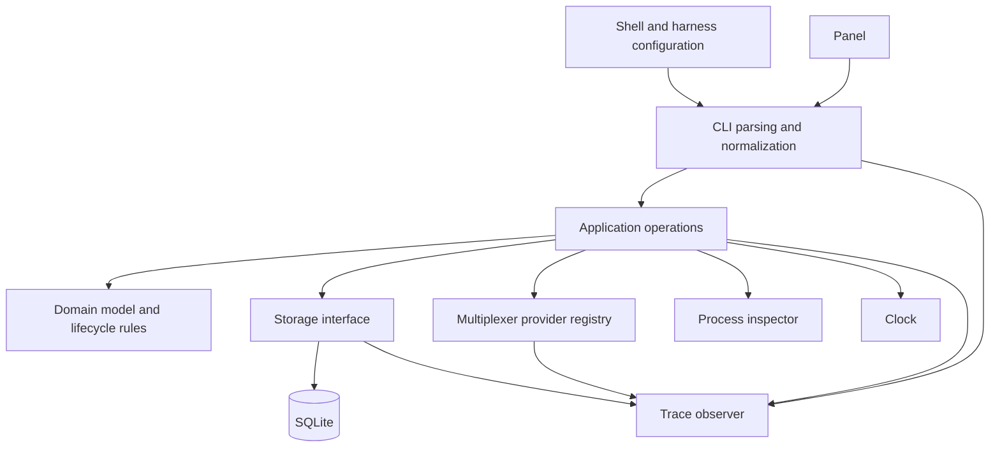

# Worklight architecture

Status: proposed architecture. The CLI and flows described here are design contracts, not implemented commands.

The project and executable are named **Worklight** (`worklight`). This document defines the public contract and component boundaries. See [scenarios.md](scenarios.md) for end-to-end command flows.

Supported operating systems are **Linux and macOS only, with feature parity required**. Every supported feature must provide the same public behavior and lifecycle guarantees on both systems. Platform-specific implementations and default filesystem locations may differ. Neither platform may substitute reduced lifecycle confidence merely because a required platform adapter is missing. See [tech-stack.md](tech-stack.md) for implementation and native validation requirements.

## 1. Purpose and scope

Worklight answers: what work is running, what needs attention, what finished, and where can I return to it? Activity identity is independent of a terminal pane. The initial deployment is local zsh and tmux, with Codex, Claude Code, and pi integrations.

Supported use cases:

1. Automatically record selected interactive foreground command lines without requiring a command prefix.
2. Report command start, duration, and success/failure from the shell's exit status.
3. Record agent sessions and turns, including running, waiting for input/approval, turn completion, interruption when observed, and idle sessions.
4. Retain outcomes while the panel is closed and after other work starts in the same pane.
5. Navigate to the originating multiplexer location, using a provider selected at runtime.
6. Acknowledge outcomes independently of execution state.
7. Recover from missing start/end events, superseded turns, lost command completion reports, and unresolvable owners.
8. Remove terminal history opportunistically after 72 hours.
9. Diagnose any operation with timed tracing and preview operations without logical persistent-state changes or navigation.
10. Integrate another shell or harness through configuration/scripts calling the stable CLI, without changing core state logic.

A shell activity represents one submitted foreground command line, including a supported compound line or pipeline. Its exit status follows the shell's existing semantics. Selection rules are integration configuration, not core command-name rules. Recognized agent launches create ordinary command activities for process lifetime. The panel groups these with their linked harness sessions instead of displaying duplicate live rows.

Initially excluded: background/detached jobs, suspend/resume job control, automatic discovery of preexisting processes, generic progress/readiness inference, full process trees, durable terminal logs, remote aggregation, process cancellation/restart, a permanent daemon, scheduled notifications, and dynamically loaded multiplexer plugins. Unsupported shell job-control cases must be excluded or reported as uncertain, never treated as completed merely because a prompt appeared.

## 2. Components



All components are modules in one executable. Hooks run short-lived CLI processes. The panel queries the CLI rather than accessing SQLite directly.

| Component | Responsibility |
|---|---|
| CLI boundary | Parse JSON or flags into the same typed requests; validate shapes; format responses and exit codes |
| Application operations | Coordinate identity, ensure/start/update/finish/acknowledge, reconciliation, retention, and navigation |
| Domain model | Enforce lifecycle rules without SQL, shell commands, filesystem access, or provider-specific parsing |
| Storage interface | Transactional reads/writes, queries, revisions, deduplication receipts, schema migration, maintenance lease |
| SQLite implementation | Local user-owned storage, concurrent readers, bounded writer contention, short transactions |
| Provider registry | Select runtime multiplexer and dispatch stored locations to their providers |
| Process inspector | Return alive/gone/unknown using PID, boot identity, and process start identity |
| Clock | UTC receipt times for records/retention; monotonic time for tracing durations |
| Trace observer | Record operation spans without changing domain behavior or normal stdout |

Reads, transition validation, and writes that form one operation occur in one transaction. External inspection runs outside write transactions, with revisions rechecked before applying findings. The SQLite database resides in the platform application-data directory; `--database` overrides it. Do not store environment dumps, raw harness payloads, or command output.

Dry-run uses the same transition functions against an in-memory snapshot/overlay. It does not run normal writes and roll them back: that can still touch database files, journals, locks, and external systems.

## 3. Integration contract and identity

An integration is shell/harness-side configuration, optionally supported by a script or extension. It maps native events to worklight operations, chooses labels, supplies correlation, preserves shell status, and consumes CLI responses so they do not become agent hook decisions.

### Process activities and harness sessions

Every selected foreground invocation, including an agent executable, gets a shell-owned `command` activity. The shell reports its exit through the same `finish` or `shell reconcile` command used for `make test`. There is no `session exited` command.

Before launching a recognized agent, the shell integration exports the unique command activity ID as `WORKLIGHT_LAUNCH_ID`. The agent and its hooks inherit it. `session ensure` accepts `process_activity_id`, defaulting to this environment value for agent-session creation. The CLI validates that the referenced record is a command activity and records an immutable link. Standalone harness integrations may omit the link when no launch environment is set. Explicit JSON `process_activity_id: null` or flag `--no-process-link` disables inherited linking; it is mutually exclusive with `--process-activity-id`. Nested harnesses launched through non-interactive tool shells inherit and attach to the outermost tracked launch by design; no zsh hook is assumed to run there. This is a shared launch scope, not proof of direct parentage or the inner process's lifetime. An explicitly instrumented inner launcher may override it with its own command record, but that is optional. Native conversation/harness identities still distinguish sessions within the launch. Child tool commands must not claim the inherited launch ID as a new command activity ID. The integration clears the export on return to the prompt.

The shell owns the command record via its `source_id`; the harness owns its session/turn records via a different `source_id`. Neither directly writes the other source's records. The application operation propagates process termination across the established link inside the same transaction. Source IDs provide attribution and protect against accidental cross-writes; they are not authentication credentials against another process running as the same local user. Never associate records merely by a matching pane or label.

A command completion records its actual exit code and derived success/failure. It also closes any open or dormant linked sessions and finishes unresolved turns as `unknown` with `end_reason: process_exited_without_turn_result`. Completed turn results and already-closed sessions remain unchanged. Process success does not imply turn/task success. The session exposes the process outcome separately as nullable computed `process_result`; a late exit report after SessionEnd still updates the command record. SessionEnd never finishes the command or terminally closes the Worklight session: the harness may continue running, time out an internal session, clear context, or resume a conversation. It marks the harness session dormant. Only linked process completion, verified tracking loss, or explicit abandonment is terminal. For nested sessions the inherited link observes the outermost tracked process, so an inner exit can remain dormant until that outer process exits.

If completion races with lazy session creation, a session linked to an already-terminal process is created closed; attempting to start a turn then conflicts. This prevents ghost live sessions after process exit. Propagation increments affected revisions without fabricating harness sequences. One process may link multiple native conversation sessions.

### Session incarnation

Distinguish a native conversation ID from a Worklight session incarnation. Recommended deterministic ID:

```text
hash(harness, native_session_id, WORKLIGHT_LAUNCH_ID)
# Without a launch record but with verified process identity:
hash(harness, native_session_id, machine_id, boot_id, owner_pid, owner_start_id)
```

The launch activity ID is unique per invocation and supplies incarnation identity without discovering a harness PID. When using the process-identity fallback, including process start identity avoids PID reuse. Do not assume the hook payload supplies the harness PID, and do not use the transient hook process as the owner. Process ancestry discovery is an optional, version-tested integration technique, not a core guarantee.

If an owner cannot be verified, an optional launcher may generate a token once and export it to its hooks. Derive the ID from `(harness, native_session_id, machine_id, token)`; no persistent mapping file is needed.

Without a launch ID, verified owner, or inherited token, use `hash("unverified", machine_id, boot_id, harness, native_session_id)` and `identity_scope: conversation`. Derive the source ID from the same fallback key rather than a fresh hook PID. This deliberately identifies a logical conversation, not a process incarnation: resumes in the same boot share the record, simultaneous processes opening that native conversation can collide, and only one active turn is representable. Origin is the first observed location and is not silently rebound; a later incompatible location is an explicit identity conflict. Such sessions are labeled unverified and must not be advertised as full process tracking. Missing native identity requires an integration-supplied token; do not invent identity from a pane alone.

Use `identity_scope: launch` for launch-linked/token identities and `process` for verified process identities. SessionEnd is nonterminal for all scopes, including fallback conversations; thus ordinary fallback resume does not hit a terminal record. After explicit abandonment or confirmed tracking loss, that record remains terminal; resuming then requires an explicit new launch/incarnation token. This is a documented limitation of fallback mode, not a promise of transparent process separation. Dormant unverified records can remain until manually abandoned; age alone does not prove their process died.

A new tracked process normally creates a new incarnation. Within the same live launch/process, SessionEnd followed by SessionStart with the same native ID reuses the session, preserving completed turns and receipts. If clear/resume returns a different native ID, ensure creates another session under the same launch. Source values such as `resume` or `clear` are event context, not unique incarnation tokens. The design supports either native-ID behavior and does not depend on an unverified claim that Claude `/clear` preserves its ID. Live adapter tests must record this for each supported version.

### Turns and correlation

Prefer native turn/event IDs. Where absent, a synchronous start hook may obtain a worklight-generated turn ID and the integration must propagate it through a harness-supported context or a documented correlation mechanism. Hooks targeting only 'the current turn' cannot safely handle delayed completion from a previous turn; the core does not promise to solve missing correlation. A compatibility integration without turn correlation must serialize lifecycle delivery and disclose that limitation.

Claude Code's Stop does not cover user interruption; Codex exposes a separate Interrupt event. An integration can therefore miss a previous turn's end. New turn start supports atomic supersession rather than requiring a query and separate finish. This is recovery for a missing end event, not evidence that the previous task succeeded. [Claude hooks](https://code.claude.com/docs/en/hooks#stop), [Codex hooks](https://learn.chatgpt.com/docs/hooks).

### Required hook delivery and permission mapping

**All Worklight lifecycle hooks must run synchronously. Never configure `async: true`, background the reporting process with `&`, or enqueue it for later execution.** This applies to shell, Codex, Claude Code, and pi integrations, including source-ordered integrations in the initial release. Use one Worklight reporter per native lifecycle event and wait for its CLI invocation. Configuration validation must reject background Worklight reporters. Other unrelated user hooks may be asynchronous. Synchronous reporting does not serialize upstream parallel tool calls; use source-supported correlation or a conservative mapping where native ordering is ambiguous.

For Claude approval state, use synchronous `PermissionRequest`, with observed subsequent tool completion/failure or resumed work clearing the state. Do not map `Notification.permission_prompt`, `idle_prompt`, or other delayed notifications to running/waiting/idle lifecycle mutations. Those notifications can arrive after the state they describe. The documented Notification fields do not guarantee `tool_use_id`, and PermissionRequest explicitly omits it, so the initial contract does not depend on a shared correlation ID. No `--correlation` extension is added on that assumption. Where the synchronous event does not cover a prompt (for example a version-specific network approval), report less detail rather than use a stale notification to overwrite current state. Parallel approval flows without reliable correlation likewise require conservative reporting. [Claude hook reference](https://code.claude.com/docs/en/hooks).

### Ordering without counter files

`sequence` is optional. Entities choose `receipt` ordering by default, or `source` ordering when a source sequence is supplied at creation. Receipt ordering is the order in which Worklight serializes operations in the database, not a guarantee about when native events happened.

- `receipt`: omit sequences; use request deduplication, explicit entity IDs, revisions, and lifecycle guards.
- `source`: require positive increasing sequences for that entity. A lower sequence returns an explicit `STALE_SEQUENCE` error; a reset cannot fail silently forever.
- Do not mix ordering modes within an entity. A new incarnation can choose another mode.
- Wall-clock nanoseconds are not a reliable source sequence: clocks can jump, readings collide, and delivery can reorder.

Receipt mode makes fresh hook processes practical, but cannot correct arbitrary reordered intermediate running/waiting events. Terminal states are protected, and late events for a superseded turn cannot mutate the replacement turn. Integrations requiring exact intermediate ordering must use native order information or synchronous lifecycle reporting.

## 4. Data model

IDs are opaque nonempty strings. Times are RFC 3339 UTC. Nullable output fields are explicit `null`. Core records are current-state records; there is no full event log or replay feature.

### Origin

```json
{
  "machine_id":"machine-1",
  "location":{"provider":"tmux","version":1,"locator":{"server_instance":"server-1","socket":"/path/to/socket","pane_id":"%12"}},
  "owner":{"boot_id":"boot-1","pid":1234,"start_id":"process-start-1"},
  "lifetime":"process"
}
```

`location` and `owner` may be null. Locator contents belong to the provider. `lifetime` is `process` (verified owner required), `location` (non-null location required), or `unverified`. A location-bound record means tracking ends when that location definitively disappears; it does not assert the underlying process died.

### Activity

Fields: `id`, `kind` (`command` or `agent_turn`), `source_id`, `session_id` (nullable), `label`, `cwd`, `origin`, `state` (`running`, `waiting_input`, `waiting_approval`, `finished`), `outcome` (nullable; `succeeded`, `failed`, `turn_finished`, `interrupted`, `unknown`), `exit_code` (nullable integer), `end_reason` (nullable string), `started_at`, `updated_at`, `finished_at` (nullable), `acknowledged_at` (nullable), `acknowledgment_reason` (nullable; user or linked_process_success), `has_agent_session` (boolean; command only, false for turns), `ordering` (`receipt` or `source`), `last_sequence` (nullable integer), `revision` (integer).

`finished` means the tracked activity record is terminal. With `outcome: unknown` and `end_reason: tracking_lost` it does not assert actual process completion. `needs_attention` is computed from waiting states or unacknowledged terminal outcomes. A command linked to at least one harness session is automatically acknowledged when it exits 0; this suppresses redundant successful process-exit attention regardless of turn acknowledgments. Set `acknowledged_at` to completion time and `acknowledgment_reason: linked_process_success`. Turn outcomes remain independently unseen/acknowledged; unresolved turns closed as unknown still need attention. Nonzero/unknown process outcomes and successes of ordinary commands are never auto-acknowledged. A late valid session link to an already-succeeded process applies the same policy atomically. Once linked, the process retains `has_agent_session: true` even if the session is later deleted. `elapsed_ms` is nonnegative and stops at `finished_at`; for tracking loss it is observed tracking duration, not verified execution duration.

### Agent session

Fields: `id`, `native_session_id` (nullable), `process_activity_id` (nullable immutable command ID), `source_id`, `harness` (open string), `label`, `cwd`, `origin`, `identity_scope` (launch, process, or conversation; inferred from launch/token or verified owner, otherwise conversation), `status` (`open`, `dormant`, or `closed`), `last_harness_end_at` (nullable), `harness_end_reason` (nullable string), `active_turn_id` (nullable), `opened_at`, `updated_at`, `closed_at` (nullable), `close_reason` (nullable), `ordering`, `last_sequence` (nullable), `revision`.

Computed `process_result` is the linked command's `{state, outcome, exit_code}` when retained, otherwise null. Origin is copied at session creation, so process-history expiration does not remove navigation. Computed `display_state` is closed, dormant, the active turn's state, or idle. Dormant means a harness lifecycle boundary was observed while process lifetime remains unresolved; it is not a terminal outcome. Computed `liveness` is verified, location_bound, or unverified; unverified sessions must not be presented as confidently live idle agents. Child transitions increment the session revision atomically where they affect current state.

Historical links do not extend retention or cascade-delete sessions. A command record may expire before a later-observed session record; queries tolerate an expired process link and return `process_result: null`.

### Deduplication receipts

Store `(source_id, request_id)`, normalized payload digest, target identity, and acceptance time. Check receipts before lifecycle validation or supersession. A repeated identical request returns a no-op; reuse with a different payload is a conflict. Receipts are retained for 72 hours from acceptance, independently of whether an active entity survives longer. This is a bounded retry guarantee, not a permanent event log. Old terminal IDs still cannot reopen while their records exist. Replay after both record and receipt expiration is unsupported.

## 5. Lifecycle rules

- Commands: running → succeeded for exit 0; failed for nonzero; interrupted only with independent evidence; unknown for lost tracking or authoritative reconciliation without a result.
- Ordinary zsh reporting of exit 130 is **failed, exit 130**. Exit status alone does not establish SIGINT; a program can explicitly exit with that value. The initial zsh integration is not required to emit interrupted.
- Agent turns: running ↔ waiting_input/waiting_approval → turn_finished, failed, interrupted, or unknown. Normal turn completion does not establish task success.
- A new turn may replace the session's active turn when `supersede` is supplied. The old turn becomes unknown by default, or interrupted only on an explicit integration assertion. Replacement and creation are atomic.
- Session ensure creates a missing open session or returns a matching one. When dormant, it marks the same session open/idle without erasing history or resetting sequence/identity. When already open it does not reset active state or labels. Turn start also reactivates a dormant session atomically, covering a missed SessionStart. A truly closed session cannot reopen.
- Harness SessionEnd maps to `session end`: finish any unresolved turn as unknown (or interrupted if explicitly established), clear the active turn, and mark the session dormant. Retain the raw harness reason separately. A repeated event is deduplicated; an end report on an already-closed session is a no-op. Terminal closure occurs only through linked process finish, verified tracking loss, or explicit session abandonment. `session close` is removed to avoid confusing a harness boundary with process termination.
- Unknown activity IDs are errors. Only explicit ensure or start-with-ensure creates a missing session.
- A terminal activity never reopens or changes outcome. A late event for an old turn is a no-op with a reason, or a conflict if it requests an incompatible terminal result.

## 6. CLI conventions

Global flags: `--database <path>`, `--protocol-version 1`, `--trace`, `--dry-run`. They are flags, not subcommands, and are valid for every operation.

Structured operations accept `--json -` for one UTF-8 JSON object on stdin. They also accept flags for scalar fields; do not mix JSON input and body flags. Field `request_id` maps to `--request-id`, etc. Nested origin accepts `--origin-file <path>`; start accepts `--ensure-session-file <path>`. Both formats normalize to the same typed request and lifecycle validation.

Labels accept exactly one of `--label <text>`, `--label-file <path>`, or `--label-env <variable-name>`. File/env input is read literally, never evaluated. The CLI escapes JSON itself. Normalize line breaks/control characters for display and replace invalid UTF-8 bytes with U+FFFD, returning a normalization warning. Labels are display metadata, not executable command text. IDs must remain valid UTF-8, be nonempty, and fit 512 UTF-8 bytes; reject invalid/oversized identity fields rather than truncate them. Normalize labels, then retain at most 512 Unicode scalar values including a final ellipsis, returning `LABEL_TRUNCATED` with the retained length. Oversized labels must not reject start. Apply identical truncation to flag, file, environment, and JSON label input; stream/discard excess label bytes with bounded memory while still validating JSON structure. Bound non-label metadata separately (64 KiB total, nesting depth 32); malformed or oversized structural metadata can be rejected. Do not put an aggregate pre-parse limit on label bytes that defeats this policy. For text exceeding OS argument/environment limits, use `--label-file`; the CLI cannot recover an invocation the OS refused to launch.

Every invocation emits one response JSON object on stdout. Integrations consume or redirect it. Errors use the same envelope; diagnostics and trace go to stderr.

```json
{"api_version":1,"ok":true,"dry_run":false,"data":{"applied":true},"warnings":[]}
```

```json
{"api_version":1,"ok":false,"dry_run":false,"error":{"code":"STALE_SEQUENCE","message":"Sequence is below the accepted sequence","retryable":false},"warnings":[]}
```

Exit codes: 0 success/no-op, 2 invalid input, 3 not found, 4 identity/lifecycle/sequence conflict, 5 busy/unavailable, 6 navigation unavailable, 1 unexpected failure. Mutations return `applied`, and `reason` (`applied`, `duplicate`, `already_exists`, `already_terminal`, or `already_acknowledged`), plus their resulting record(s). Queries return records with computed fields.

Only source-reported operations (session ensure/end, start/update/finish, and shell reconcile) require producer metadata. User actions acknowledge/abandon and maintenance have no source requirement and use internal revisions.

Event mutation metadata: required `source_id`; optional `request_id` generated if omitted and included in the response; optional `sequence` subject to ordering mode. Stable request IDs are required for guaranteed retries; a generated ID lost with its response provides no automatic retry guarantee. `observed_at` is optional diagnostic metadata, never the retention clock. Repeated session ensure is idempotent by entity identity even with a fresh request ID.

### Commands and shapes

| Command | Body/flags beyond common metadata | Response `data` |
|---|---|---|
| `origin capture` | `--multiplexer` (auto, none, or provider), `--owner-pid <pid>`, `--lifetime` (process, location, or unverified) | `origin`, `detection` (matched, none, or explicit) |
| `session ensure` | `id`, `harness`, `label`, `cwd`; optional `native_session_id`, `origin`, `process_activity_id`, `identity_scope` | `session`, mutation fields |
| `session open` | Alias for `session ensure` | Same |
| `start` | `id`, `kind`, `label`, `cwd`; command: optional `origin`; turn: required `session_id`, optional `ensure_session`, `supersede` (unknown or interrupted) | `activity`, `superseded_activity` (nullable), mutation fields |
| `update <activity-id>` | `state` (running, waiting_input, or waiting_approval) for active turns only | `activity`, mutation fields |
| `finish <activity-id>` | Command: `exit_code`, or explicit `outcome: interrupted`; turn: `outcome` (turn_finished, failed, or interrupted) | `activity`, mutation fields |
| `session end <id>` | `reason` (raw native reason string), optional `active_turn_outcome` (unknown by default, or interrupted with evidence) | `session`, `finished_activity` (nullable), mutation fields |
| `shell reconcile` | `source_id`, `through_activity_id`; optional `exit_code` | `finished_activities`, mutation fields |
| `abandon <activity-id>` | `--reason <text>` required | `activity`, mutation fields |
| `session abandon <id>` | `--reason <text>` required | `session`, `finished_activity` (nullable), mutation fields |
| `get <id>` / `session get <id>` | ID | `activity` / `session` |
| `list` | `--view` (attention, active, history, or all), `--kind` (command or agent_turn), `--session-id`, `--limit 1..200`, `--cursor` | `items: Activity[]`, nullable string `next_cursor` |
| `session list` | `--status` (open, dormant, live, closed, or all), `--limit`, `--cursor` | `items: Session[]`, `next_cursor` |
| `acknowledge <activity-id>` | ID | `activity`, mutation fields |
| `location resolve <activity-id>` | ID | `status` (available, missing, unknown, unsupported, or none), nullable string `address` |
| `focus <activity-id>` / `session focus <id>` | `--client <opaque-id>` when required | `focused: true`, `provider`, `address` |
| `maintenance` | `--force` optional | `ran`, `reason` (due, forced, not_due, or already_running), `reconciled`, `deleted_activities`, `deleted_sessions`, `deleted_receipts`, `checked_at` |
| `panel` | `--client <opaque-id>`, optional `--multiplexer <provider>` | Interactive UI on terminal; response on exit with `closed: true` |

For interactive panel rendering use the controlling terminal rather than protocol stdout. `panel --dry-run` returns a launch/maintenance plan without opening a UI.

For linked sessions, copy the linked process origin unless an explicitly supplied origin is validated as compatible. The command owner may be the shell; this is supervising-shell liveness, not proof of harness liveness. A successful prompt return supplies authoritative process termination. If neither process completion nor prompt reconciliation is delivered, process existence alone may leave uncertainty.

Origin defaults: capture a verified owner only when explicitly supplied, otherwise leave owner null. Choose process lifetime when the owner is verified, location lifetime when only a location is available, and unverified otherwise. An explicit incompatible lifetime is invalid input. Session ensure and command start may omit origin to use these defaults; turns inherit session origin. This makes ordinary pane-bound hooks eligible for tracking-loss cleanup without inventing a harness PID.

### Atomic lazy ensure and supersession

```json
{
  "source_id":"claude-incarnation-1","request_id":"prompt-event-2",
  "id":"turn-2","kind":"agent_turn","session_id":"session-1",
  "label":"Continue the review","cwd":"/projects/app",
  "ensure_session":{"id":"session-1","harness":"claude","label":"Review","cwd":"/projects/app"},
  "supersede":"unknown"
}
```

`ensure_session` uses the outer source ID; its ID must equal `session_id`. It accepts the same identity fields as session ensure, not independent event metadata. A missing session is created in the same transaction. Existing matching open sessions retain their state; matching dormant sessions are reactivated. Terminal linked-process checks take precedence, so ensure cannot reactivate a session whose process ended. Identity mismatches (source, harness, native identity when supplied, origin incarnation and process activity ID when supplied) fail. Mutable initial labels/directories do not cause an ensure conflict or overwrite an existing session.

If a different turn is active and `supersede` is absent, return conflict. If present, terminate that turn before assigning the new one. Deduplicate the start request before replacing anything: a retry of an old start must not supersede a newer turn. Turn updates/finishes always name the intended turn, never redirect to the session's current turn.

### Shell input and prompt reconciliation

```sh
worklight start --kind command --id "$run_id" --source-id "$shell_id" \
  --request-id "$start_event_id" --label "$command_line" --cwd "$PWD"
worklight finish "$run_id" --source-id "$shell_id" \
  --request-id "$finish_event_id" --exit-code "$saved_status"
```

The CLI accepts labels as an argument value even when that value begins with a hyphen. Shell code passes each value as one quoted argument and never builds JSON by string concatenation.

At pre-prompt, the shell has authoritative knowledge that its supported foreground command line returned. It can combine completion and repair in one call:

```sh
worklight shell reconcile --source-id "$shell_id" \
  --through-activity-id "$run_id" --exit-code "$saved_status" \
  --request-id "$prompt_event_id"
```

The named command establishes a stored creation boundary. In one transaction, finish it from the captured status if still active, and finish earlier unresolved command records for the same shell source as unknown with reason `prompt_returned_without_result`. Never apply that exit code to earlier commands. Do not directly target other sources, agent turns, or commands created after the boundary. Finishing a command also applies the linked-session termination rule, including closing unresolved turns as unknown. A duplicate reconciliation cannot finish future work. The shell must report synchronously before accepting new input and only for supported foreground execution. At pre-prompt, save status first and check stopped-job state before invoking reconciliation. On Linux, status 148 commonly represents `128 + SIGTSTP`; skip reconciliation for this status conservatively and whenever zsh reports a stopped tracked job. On macOS, SIGTSTP commonly yields 146 instead: determine the platform signal value/job state rather than hard-code 148 as the only guard. A program can also exit explicitly with either status, so conservative skipping can defer a real failure. Do not invent completion. Preserve the suspended run association in shell-local bookkeeping, but clear the exported ambient `WORKLIGHT_LAUNCH_ID` before accepting another command so unrelated children cannot inherit it. The next selected command's reconciliation can mark the suspended record unknown even if the stopped job still exists or later completes; subsequent `fg`/`bg` completion is not attributed to the original run in this version. This is an explicit job-control limitation, not supported suspend/resume tracking. If the boundary record is missing, return not found rather than sweeping by an unbounded source ID.

`abandon` is an explicit user remedy that ends tracking as unknown without killing a process. It does not require proof of process death. Abandoning or reconciling a linked process as unknown also closes its open or dormant sessions with a tracking-loss reason, preserving known turn outcomes. The corresponding session operation closes tracking and handles its active turn atomically. Repeated abandonment is idempotent and does not rewrite a known outcome.

### Queries

Defaults: `list --view all --limit 50`, `session list --status live --limit 50`. Attention includes waiting and unseen terminal outcomes; active includes nonterminal records; history includes all terminal records. Sort waiting first, unseen failures/unknowns next, other unseen outcomes, active work, then acknowledged history. Use descending update time and ID tie-breakers. Session ordering is descending update time then ID. Cursors are opaque and bound to filters; live pages are not a durable snapshot.

`--status live` includes open and dormant sessions; `open` includes only open sessions. Dormant entries sort below live working/idle entries and are not presented as requiring attention. Acknowledgment only applies to terminal outcomes, is idempotent, and never changes retention time. Automatic acknowledgment of linked exit-0 process records is defined in the activity model. Ordinary queries do not run cleanup.

## 7. Trace and dry-run

### Trace

`--trace` emits newline-delimited JSON spans to stderr, preserving the normal stdout response and exit code. Trace spans include parsing, normalization, database open/read, deduplication, provider detection/resolution, process inspection, lifecycle evaluation, transaction wait/write/commit, reconciliation, retention, and navigation when those stages execute.

Each started span emits an end record on normal completion or handled error with monotonic `elapsed_ms`, status, trace ID, span ID, parent span ID, and operation name. Emit a total operation span last. Do not sum nested spans as independent elapsed time. A killed process cannot guarantee closing spans.

```json
{"trace_id":"t1","span_id":"s2","parent_span_id":"s1","event":"end","operation":"storage.commit","status":"ok","elapsed_ms":1.8}
```

Include counts, identifiers, dry-run mode, and typed errors; omit SQL parameters, raw command labels, prompts, environment contents, and raw hook payloads by default. Trace is opt-in and not stored in the activity database. Users can redirect stderr to a file themselves.

### Dry-run

`--dry-run` reads existing state, validates the request, performs read-only inspection, and computes planned effects through the same domain functions. It must not create/migrate the database, create directories, update receipts/leases/timestamps, initialize provider tokens, delete history, focus a client, or open a popup. A missing database is modeled as empty; an incompatible schema returns an explicit error instead of migrating.

The guarantee is **no logical content change**, not filesystem byte invariance. SQLite may create/remove WAL/SHM sidecars or update lock/shared-memory bookkeeping while obtaining a consistent read of an existing database, including after the last connection closed. Allow these SQLite-managed effects; do not reject a quiet WAL database merely because sidecars are absent. Open the main database read-only with query-only protection where supported; use the normal consistent snapshot mechanism and permit the sidecar access SQLite requires. No Worklight DML/DDL, migrations, receipts, leases, manual checkpoint/vacuum, or journal-mode changes are allowed. Do not mark a live database immutable. A genuinely unwritable environment that prevents a consistent read can still return unavailable. [SQLite WAL read-only behavior](https://sqlite.org/wal.html#read_only_databases).

For mutations, replace the normal result body with a preview shape:

```json
{
  "api_version":1,"ok":true,"dry_run":true,
  "data":{
    "would_apply":true,
    "effects":[{"action":"update","entity":"activity","id":"run-1","changes":{"state":"finished","outcome":"failed","exit_code":2}}],
    "result":{"activity":{"id":"run-1","state":"finished","outcome":"failed"}}
  },
  "warnings":[]
}
```

The example's result record is abbreviated; actual responses contain the complete normal record shape. `effects` actions are create/update/delete/navigate/open_panel, with entity, ID/target, and relevant changes. Queries return normal data with `dry_run: true`. Conflicts still return errors. Maintenance previews counts and deletions without acquiring a write lease. Navigation previews the resolved destination and returns no `focused: true` claim. Preview is a snapshot, not a reservation or guarantee that later execution will have identical effects. `--trace --dry-run` is supported.

## 8. Multiplexer providers and panel

Providers expose `detect(environment)`, `capture(environment, readOnly)`, `resolve(location)`, `focus(location, clientContext)`, and optional `openPanel(command, clientContext)`. The registry auto-selects exactly one matching provider. None means no location; multiple matches require an override. A stored location dispatches to its stored provider/version, never to a newly detected substitute.

The tmux provider stores server-instance and pane identity, resolving display addresses dynamically. Reused sockets/pane IDs after server restart must not redirect old history. Any server-token initialization is a mutation and is prohibited during dry-run. Missing tokens during a preview yield an explicit unresolved origin warning/plan, not a persisted token.

Popup hosting must carry the initiating client explicitly. Do not rely on `TMUX_PANE` inside a popup to identify the client. The tmux binding/provider captures `#{client_name}` when launching the popup and passes its safely quoted value through `--client`. Conceptually the binding launches `worklight panel --client <expanded client_name>`. The concrete binding must escape the value for each tmux/shell parsing layer; it must not interpolate an unescaped client name into shell text. The panel forwards this context on focus calls. If missing or ambiguous, return an error rather than selecting an arbitrary attached client. [tmux manual](https://man.openbsd.org/tmux).

The panel invokes maintenance on entry, then queries/refreshes activities and sessions. Group linked process/session/current-turn records to avoid duplicate live rows; keep a process failure visible even if its last turn was already complete. Join current turns to sessions; retain older unseen outcomes separately. Opening the panel does not acknowledge everything. Successful navigation may acknowledge the selected terminal result. Missing panes remain historical rows; old output is not restored. Unverified sessions are explicitly labeled and expose abandon actions.

Adding a multiplexer requires a provider implementation/registration initially. Adding a harness with compatible events ordinarily requires external configuration, not core changes. Provider popup support is optional; a normal terminal UI is the fallback.

## 9. Reconciliation and retention

Maintenance runs on panel entry, at most once per hour across CLI processes, with an expiring transactional lease. `--force` bypasses the due interval, not an active lease. Failed maintenance does not prevent querying stored state.

Reconciliation policies:

- Verified process lifetime: inspect PID plus boot/start identity. Definitively gone means tracking ends unknown unless an outcome was already reported. Permission errors mean unknown liveness.
- Location lifetime: confirmed pane/server disappearance ends tracking with unknown outcome and `end_reason: tracking_lost`. Do not claim the underlying process exited. Unsupported provider, transient connection failure, or ambiguous location is not confirmed disappearance.
- Unverified lifetime: display uncertainty; do not present everlasting verified idle status. Expose explicit abandon. Age alone never proves completion. Without a lifetime signal, automatic removal of genuinely live records cannot be made reliable; this limitation is visible rather than hidden.
- Shell prompt reconciliation repairs missed completions under a still-live shell, bounded to that source and command creation boundary.

Snapshot revisions before inspection and recheck before applying changes. Session/current-turn changes are transactional so reconciliation cannot close a newly started turn based on an older snapshot.

Retention: delete terminal activities whose terminal timestamp is strictly older than 72 hours, regardless of acknowledgment. Delete closed sessions older than 72 hours once child records are eligible. Delete receipts older than 72 hours. Keep nonterminal activities and open/dormant sessions regardless of age; unknown tracking-end outcomes receive the same 72-hour retention from observation/abandonment. No count-based deletion policy or scheduler. SQLite may retain allocated pages for reuse; logical deletion does not require vacuuming on each sweep.

## 10. Validation criteria

- Retain distinct command runs in one pane and outcomes generated while the panel was closed.
- Agent and build exits use the same command reporting API; process failure and turn outcome remain separate.
- Shell/harness sources cannot directly mutate each other's records; linked termination propagates transactionally.
- Process exit racing with session ensure/turn start never leaves a live session linked to a finished command. Late SessionEnd and duplicate completion are harmless.
- Nested non-interactive harnesses deliberately share the outermost tracked launch; explicit instrumented overrides remain isolated. Inner SessionEnd marks dormant rather than falsely proving inner process exit.
- Expiring a process record does not cascade-delete more recent sessions or lose their copied origin.
- Missing agent end event followed by new prompt atomically supersedes the old turn; a duplicate old start never supersedes new work.
- Receipt ordering needs no sequence counter file. Source-sequence resets return visible errors. Late events cannot change another turn.
- Concurrent lazy ensures create one session without resetting active state; conflicting incarnations fail. Dormant sessions resume under the same ID while truly closed sessions cannot reopen.
- Idle-timeout SessionEnd/resume and clear/resume under both unchanged and changed native IDs preserve trackability within one live process; repeat the cycle more than once.
- Worklight reporters configured with async/background execution are rejected; delayed Notification events cannot mutate lifecycle state.
- Fallback conversation identity is deterministic without process evidence and explicitly exposes merge/collision and post-abandonment limitations.
- Resumed native sessions map deterministically to new process incarnations; missing owner discovery never substitutes a hook PID.
- Commands returning 130 report failed with that code unless independent interruption evidence exists. Stopped-job prompt returns (including Linux 148 and platform-specific macOS status) skip reconciliation; later sweeps mark unresolved tracking unknown, not successful.
- Prompt reconciliation closes only the named/earlier commands for that shell, never other sources or later commands. Explicit abandon does not terminate processes.
- Flag labels correctly encode quotes, backslashes, control characters, leading hyphens, and invalid UTF-8 without shell-side JSON generation.
- Popup focus uses the initiating client explicitly and does not move another client. Renames remain navigable; server restart invalidates old origins.
- Trace preserves stdout/exit status and reports stage/total elapsed time on success and handled failure without sensitive payloads.
- Dry-run preserves logical tables/schema/receipts/leases and performs no navigation, while allowing SQLite sidecar/lock bookkeeping. Test both a quiet WAL database without sidecars and concurrent readers/writers.
- Long labels through flags/file/environment/JSON truncate with a warning and still start tracking; oversized IDs fail.
- Linked agent process success auto-acknowledges only the process outcome; unseen/unknown turns remain visible and ordinary command success still needs attention.
- Concurrent reconciliation cannot overwrite fresh completion. Confirmed location loss differs from provider unavailability.
- Exactly-72-hour records remain; older terminal records/receipts expire on a due sweep. Active records survive, acknowledgment has no effect on retention.
- New harness names work through the public contract, subject to explicit identity/correlation and lifecycle confidence requirements.

## 11. References

- [tmux-agent-panel](https://github.com/ahmedelgabri/tmux-agent-panel): motivating picker and hook architecture.
- [Zsh hook functions](https://zsh.sourceforge.io/Doc/Release/Functions.html): foreground execution/prompt boundaries.
- [Claude Code hooks](https://code.claude.com/docs/en/hooks), [Codex hooks](https://learn.chatgpt.com/docs/hooks), and [pi extensions](https://github.com/earendil-works/pi/blob/main/packages/coding-agent/docs/extensions.md): native events; validate exact mappings against supported versions.
- [tmux manual](https://man.openbsd.org/tmux): popup/client integration.
